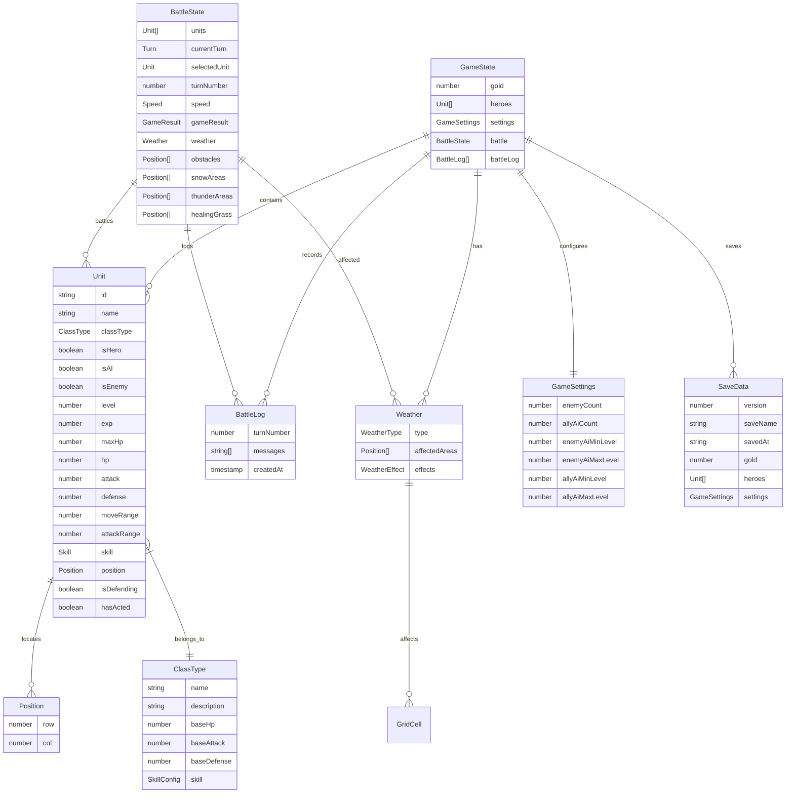
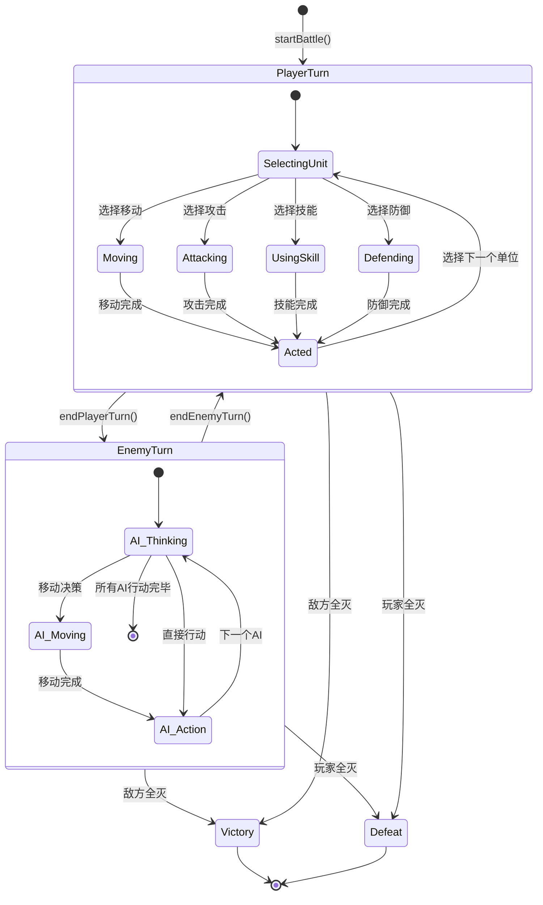
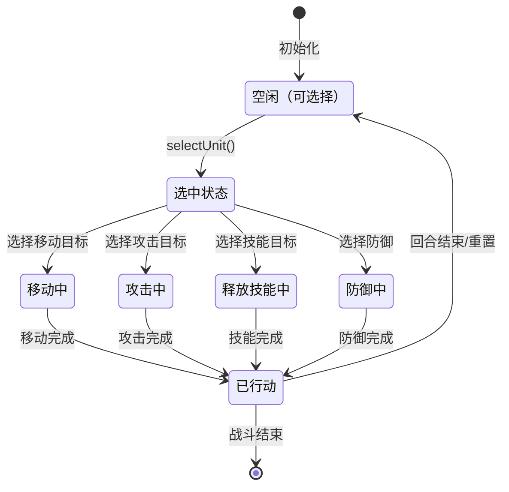
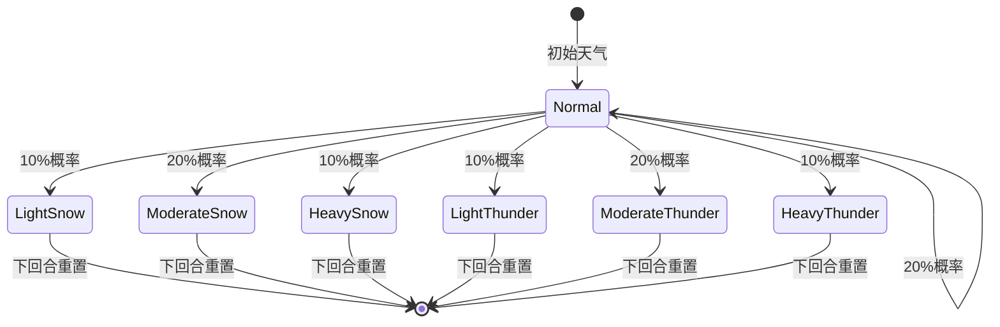

# 养成战棋游戏 - 实体关系图(ERD)

## 目录

1. [核心实体](#核心实体)
2. [实体关系图](#实体关系图)
3. [实体属性详解](#实体属性详解)
4. [数据流转说明](#数据流转说明)
5. [状态机转换](#状态机转换)

---

## 核心实体

| 实体 | 说明 | 关键字段 |
|------|------|----------|
| **Unit** | 游戏单位（主角、AI、敌人） | id, classType, isHero, isAI, isEnemy |
| **BattleState** | 战斗状态 | units, currentTurn, turnNumber |
| **GameSettings** | 游戏配置 | enemyCount, allyAiCount, levelRange |
| **Weather** | 天气状态 | type, areas, effects |
| **BattleLog** | 战斗日志 | turnNumber, messages |
| **SaveData** | 存档数据 | version, gold, heroes, saveName |

---

## 实体关系图



---

## 实体属性详解

### Unit（单位）

| 属性 | 类型 | 说明 | 约束 |
|------|------|------|------|
| id | string | 唯一标识 | 主键，非空 |
| name | string | 名称 | 非空，最大长度20 |
| classType | string | 职业类型 | warrior/knight/archer/mage/witch/assassin |
| isHero | boolean | 是否为主角 | 默认false |
| isAI | boolean | 是否为AI控制 | 默认false |
| isEnemy | boolean | 是否为敌方 | 默认false |
| level | number | 等级 | >=1 |
| exp | number | 经验值 | >=0 |
| maxHp | number | 最大生命值 | >0 |
| hp | number | 当前生命值 | 0<=hp<=maxHp |
| attack | number | 攻击力 | >0 |
| defense | number | 防御力 | >=0 |
| moveRange | number | 移动范围 | >0 |
| attackRange | number | 攻击射程 | >0 |
| skill | Skill | 技能 | 包含name, description, cooldown, currentCooldown |
| position | Position | 当前位置 | row: 0-11, col: 0-10 |
| isDefending | boolean | 防御状态 | 默认false |
| hasActed | boolean | 是否已行动 | 默认false |
| hasMoved | boolean | 是否已移动 | 默认false |
| hasAttacked | boolean | 是否已攻击 | 默认false |
| defenseBuffDuration | number | 防御buff持续回合 | >=0 |

### BattleState（战斗状态）

| 属性 | 类型 | 说明 | 约束 |
|------|------|------|------|
| units | Unit[] | 所有战斗单位 | 至少2个 |
| currentTurn | string | 当前回合 | 'player' 或 'enemy' |
| selectedUnit | Unit | 选中单位 | 可为null |
| turnNumber | number | 回合数 | >=1 |
| speed | number | 战斗速度 | 1/2/3 |
| playerUnitsActed | number | 已行动玩家单位数 | >=0 |
| totalPlayerUnits | number | 玩家单位总数 | >=1 |
| gameResult | string | 游戏结果 | 'victory'/'defeat'/null |
| aiJoinPending | boolean | AI加入待定 | 默认false |
| pendingAiSide | string | 待加入AI阵营 | 'ally'/'enemy'/null |
| pendingAiClass | string | 待加入AI职业 | null或职业类型 |
| moveMode | boolean | 移动模式 | 默认false |
| attackMode | boolean | 攻击模式 | 默认false |
| skillMode | boolean | 技能模式 | 默认false |
| skillTargets | Position[] | 技能目标位置 | 数组 |
| summonCount | number | 召唤次数 | >=0 |
| maxSummons | number | 最大召唤次数 | >=0 |
| obstacles | Position[] | 障碍物位置 | 数组 |
| snowAreas | Position[] | 雪地区域 | 数组 |
| thunderAreas | Position[] | 雷电区域 | 数组 |
| healingGrass | Position[] | 草药位置 | 数组 |
| weather | string | 天气类型 | 'normal'/'light_snow'/'moderate_snow'/'heavy_snow'/'light_thunder'/'moderate_thunder'/'heavy_thunder' |

### SaveData（存档数据）

| 属性 | 类型 | 说明 | 约束 |
|------|------|------|------|
| version | number | 存档版本号 | >=1，当前为2 |
| saveName | string | 存档名称 | 非空 |
| savedAt | string | 保存时间 | 格式：yyyyMMdd HH:mm:ss |
| gold | number | 金币数量 | >=0 |
| heroes | Unit[] | 英雄列表 | 至少1个 |
| settings | GameSettings | 游戏设置 | 完整配置 |

### Weather（天气）

| 属性 | 类型 | 说明 |
|------|------|------|
| type | WeatherType | 天气类型 |
| affectedAreas | Position[] | 影响区域 |
| effects | WeatherEffect | 天气效果 |

### WeatherType（天气类型）

```typescript
type WeatherType =
  | 'normal'              // 晴天
  | 'light_snow'         // 小雪（1个3×3区域）
  | 'moderate_snow'      // 中雪（2个3×3区域）
  | 'heavy_snow'         // 大雪（3个3×3区域）
  | 'light_thunder'      // 小雷雨（6个1×1区域）
  | 'moderate_thunder'   // 中雷雨（3个2×2区域）
  | 'heavy_thunder'      // 大雷雨（5个2×2区域）
```

### WeatherEffect（天气效果）

```typescript
interface WeatherEffect {
  movementDisabled: boolean   // 禁止移动（雪地）
  damagePerTurn: number       // 每回合伤害百分比（雷电）
  damageType: string          // 伤害类型
  visualEffect: string        // 视觉效果
}
```

---

## 数据流转说明

### 战斗流程数据流

```
初始化阶段
    ↓
startBattle()
    ↓
创建玩家单位/敌方单位
    ↓
生成障碍物
    ↓
初始化天气
    ↓
战斗开始

玩家回合
    ↓
选择单位 → selectUnit()
    ↓
操作选择 → move/attack/skill/defend
    ↓
执行操作 → 更新状态
    ↓
标记已行动
    ↓
endPlayerTurn()

敌方回合
    ↓
executeEnemyTurn()
    ↓
AI决策循环
    ↓
applyThunderDamage() → 应用雷电伤害
    ↓
checkBattleEnd() → 检查胜负
    ↓
endEnemyTurn()

下一轮开始
    ↓
updateWeather()
    ↓
重置hasActed
```

### 天气系统数据流

```
触发天气更新
    ↓
updateWeather()
    ↓
随机选择天气类型（根据概率）
    ↓
├─ 雪地天气 → generateSnowAreas()
│       ↓
│       生成雪地区域
│       ↓
│       保存到battle.snowAreas
│
└─ 雷雨天气 → generateThunderAreas()
        ↓
        生成雷电区域
        ↓
        保存到battle.thunderAreas
        ↓
        显示天气提示
        ↓
        添加到战斗日志

每回合结束
    ↓
applyThunderDamage()
    ↓
检查所有单位位置
    ↓
处于雷电区域？
    ↓
计算伤害 = maxHp × 50%
    ↓
应用伤害 → 更新hp
    ↓
显示伤害提示
    ↓
添加到战斗日志
```

### AI决策数据流

```
AI单位行动
    ↓
获取可移动位置 → getAvailablePositions(..., thunderAreas)
    ↓
当前在雷电区域？
    ↓
├─ 是 → 优先寻找非雷电位置
│
└─ 否 → 优先选择非雷电位置
    ↓
排序位置：
  1. 非雷电位置优先
  2. 距离目标近优先
    ↓
选择最佳位置
    ↓
检查是否被占据
    ↓
移动到目标位置
    ↓
尝试攻击/技能/防御
```

### 存档系统数据流

#### 保存流程
```
用户点击保存
    ↓
saveGame(saveName) / saveGameOverwrite(saveName, slotIndex)
    ↓
构造SaveData对象
    ↓
添加version字段（SAVE_VERSION）
    ↓
保存到gameSave_backup（自动备份）
    ↓
保存到gameSave_{slotIndex}
    ↓
返回保存结果
```

#### 加载流程
```
用户选择存档
    ↓
loadGame(slotIndex)
    ↓
尝试读取gameSave_{slotIndex}
    ↓
├─ 失败 → 尝试读取gameSave_backup
│
└─ 成功 → 解析JSON
    ↓
调用migrateSaveData()
    ↓
├─ version < 1 → 添加默认值
├─ version < 2 → 确保英雄完整属性
└─ ... 未来版本迁移
    ↓
验证数据完整性
    ↓
加载数据到GameState
    ↓
更新gameSave_backup
    ↓
返回加载结果
```

---

## 状态机转换

### 战斗状态机



### 单位状态机



### 天气状态机



---

## 天气概率配置

| 天气类型 | 概率 | 区域配置 | 效果 |
|----------|------|----------|------|
| Normal | 20% | 无 | 无特殊效果 |
| Light Snow | 10% | 1个3×3区域 | 雪地角色无法移动 |
| Moderate Snow | 20% | 2个3×3区域 | 雪地角色无法移动 |
| Heavy Snow | 10% | 3个3×3区域 | 雪地角色无法移动 |
| Light Thunder | 10% | 6个1×1区域 | 雷电区域角色受到50%最大生命值伤害（每回合结束） |
| Moderate Thunder | 20% | 3个2×2区域 | 雷电区域角色受到50%最大生命值伤害（每回合结束） |
| Heavy Thunder | 10% | 5个2×2区域 | 雷电区域角色受到50%最大生命值伤害（每回合结束） |

---

## 视觉效果配置

| 天气类型 | 背景颜色 | 图标 | 动画 |
|----------|----------|------|------|
| Snow | 浅蓝渐变 | ❄️ | 飘落动画 |
| Thunder | 深紫渐变 | ⚡ | 闪烁动画 |

---

## 职业配置（补充）

| 职业 | 初始攻击 | 技能冷却 | 技能效果 |
|------|----------|----------|----------|
| 战士 | 65 | 2 | 防御强化2回合 |
| 骑士 | 50 | 3 | 冲锋移动+路径伤害 |
| 弓箭手 | 40 | 2 | 远程单体×1.3 |
| 法师 | 55 | 3 | 3×3范围伤害 |
| 巫师 | 35 | 3 | 单体治疗×2 |
| 刺客 | 50 | 2 | 瞬移+4方向×1.3 |
